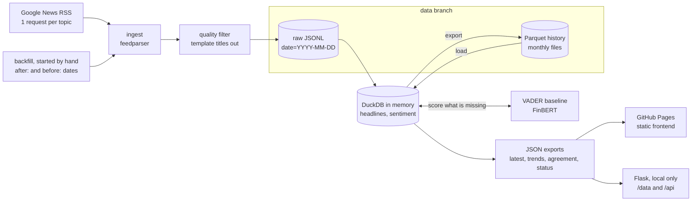

# WHY: What Happened Yesterday

[](https://github.com/Onodera-Gustavo/W-H-Y/actions/workflows/ci.yml)
[](https://github.com/Onodera-Gustavo/W-H-Y/actions/workflows/pipeline.yml)


A daily data pipeline that collects market headlines from Google News RSS, filters out template pages that are not news, keeps a deduplicated history in DuckDB and Parquet, scores sentiment with VADER and FinBERT, measures how much the two models agree, and publishes the result as a static, newspaper style site.

**Live demo:** [onodera-gustavo.github.io/W-H-Y](https://onodera-gustavo.github.io/W-H-Y/)


The site has four pages: **Today** (the edition), **Trends** (tone per topic over 7, 14 or 30 days), **Model Lab** (where VADER and FinBERT agree and where they do not) and **Pipeline** (how the edition is made and what the last run did).

## The problem

Markets move on news, and a single morning already brings hundreds of headlines across topics. WHY answers two small questions every day: what were yesterday's headlines for each topic, and was their tone positive, neutral or negative? It also shows how that tone moves over the last 30 days.

The interesting part is the plumbing behind the page. Collection has to be polite and repeatable, re-running a day must not duplicate anything, the history has to live somewhere cheap and inspectable, junk has to be kept out without hiding news, and a sentiment model's output should be checked instead of simply trusted.

## Architecture



### Daily run (GitHub Actions, 09:00 UTC)

1. Check out `main`, plus the `data` branch into `data/` (created on the first run).
2. Only when the workflow is started by hand with `backfill_days` above 0: `python -m why backfill --days N --models vader,finbert` (see [Backfill](#decisions-and-trade-offs)).
3. `python -m why run --models vader,finbert`: one RSS request per topic, quality filter, raw JSONL landing, load into DuckDB, score only the headlines that have no score yet, export Parquet, `latest.json`, `trends.json` and `status.json`.
4. `python -m why compare`: VADER x FinBERT agreement over the whole history.
5. Commit the raw JSONL and Parquet files to the `data` branch as `github-actions[bot]`.
6. Copy all of `frontend/` next to `site/data/` and deploy it to GitHub Pages.

### Data layout

| Path | Content |
| --- | --- |
| `data/raw/date=YYYY-MM-DD/<topic>.jsonl` | feed as collected: topic, title, source, link, published_at, collected_at, run_date; backfilled records also carry `"collection": "backfill"` |
| `data/history/headlines/YYYY-MM.parquet` | one row per story per topic, with dedup key and first/last seen |
| `data/history/sentiment/YYYY-MM.parquet` | one row per story per model: label and score from -1 to +1 |
| `site/data/latest.json` | the daily edition read by the frontend |
| `site/data/trends.json` | daily mean sentiment and headline counts per topic, last 30 days (`TREND_DAYS`) |
| `site/data/model_agreement.json` | percent agreement, Cohen's kappa, confusion matrix and score correlation, plus the same numbers per topic, score pairs for a scatter plot and the latest disagreements |
| `site/data/status.json` | the run that wrote it (mode, requests, new rows, filtered titles), history size, per topic, per day and top source counts, schedule and limits |

Every export reads only headlines that pass the quality filter.

### Code layout

```
why/
  config.py        topics, limits, schedule, paths
  quality.py       quality rules: template titles that are not news
  ingest.py        Google News RSS to raw records: search windows, parsing, paced requests
  backfill.py      past run dates from date searches, resumable, aborts on 403 or 429
  raw.py           JSONL landing zone, idempotent per day
  dedup.py         link normalization and dedup key
  warehouse.py     DuckDB tables, upsert, quality flags, Parquet load and export
  sentiment.py     common interface, VADER and FinBERT adapters
  metrics.py       percent agreement, Cohen's kappa, confusion matrix
  export.py        latest.json, trends.json, model_agreement.json, status.json
  cli.py           py -m why run | backfill | compare
backend/app.py     local Flask server: frontend files, /data/*.json and /api
frontend/          static site: plain HTML, CSS and ES modules, no build step
  index.html       Today: mood strip, topic tabs, lead story, label mix, 14 day trend
  trends.html      Trends: 7, 14 or 30 days per topic, daily label mix, heat strip
  models.html      Model Lab: agreement figures, confusion matrix, score scatter, disagreements
  pipeline.html    Pipeline: architecture diagram, last run, daily ingest, history, sources
  assets/css/      why.css: design tokens, light and dark themes, components
  assets/js/       common.js (data loading, site chrome), charts.js (SVG charts), one module per page
docs/og-card.html  source of the link preview image, rendered to frontend/assets/img/og.png
tests/             offline pytest suite with an RSS fixture and fake fetchers
.github/workflows/ ci.yml, pipeline.yml
```

## Decisions and trade-offs

**DuckDB and Parquet on a `data` branch instead of a database server.** About 50 headlines a day do not justify a running server or a paid bucket. DuckDB gives real SQL in process (window functions, `QUALIFY`, `COPY ... TO` Parquet), and Parquet is columnar, compressed and readable by pandas, Polars or Spark. Keeping the files on an orphan `data` branch turns every run into a commit that can be diffed, audited or rolled back, at no cost. The trade-offs: a single writer (the workflow uses a concurrency group), a branch that grows over time, and a design that would not hold millions of rows a day. To limit churn, the history is split into monthly files and written sorted, so a daily run normally rewrites only the current month and an unchanged month produces no git diff.

**VADER as a baseline, FinBERT as the finance model, and their agreement measured.** VADER is a lexicon model: instant, deterministic and download free, but built for social media text. FinBERT ([ProsusAI/finbert](https://huggingface.co/ProsusAI/finbert)) is BERT fine-tuned on financial news sentences and much heavier (PyTorch plus a ~440 MB model), so it runs only in GitHub Actions, on CPU, with the model cached. Instead of assuming either one is right, `why compare` reports percent agreement, Cohen's kappa (agreement corrected for chance), the confusion matrix and the correlation between scores for every headline both models scored, overall and per topic, and lists the most recent headlines where the two labels differ. The site shows FinBERT when available and VADER otherwise, a badge shows both scores on hover or keyboard focus, and the Model Lab page draws the whole comparison.

**A narrow quality filter instead of trusting the feed.** Google News search also returns pages generated from templates: Zacks style screeners syndicated by Yahoo Finance ("Are Investors Undervaluing Global Partners (GLP) Right Now?"), stock quote pages, market size press releases, and even a CNN page whose template never rendered ("symbol__ Stock Quote Price and Forecast"). In the first two editions they were 7 of 125 stored headlines, and in an edition capped at eight per topic they push real news out and bend a topic's sentiment. `why/quality.py` holds four documented rules, each describing the shape of a template (a ticker in parentheses inside a fixed screener sentence, a double underscore or unfilled placeholder, a title made only of quote page words, a market size release signed by a research firm), never a topic or a publisher. The filter runs at ingest before the per topic cap, so a topic still gets up to eight real headlines, and again whenever exports are built: titles stored before a rule existed stay in the raw files and Parquet, untouched, but are no longer scored and never reach `latest`, `trends`, the agreement report or `status`. Tests pin every rule to real template titles and to near-miss real headlines that must survive; when in doubt a rule does not match.

**Backfill with the daily run's semantics.** A trend chart with one day on it says nothing, so the history can be seeded once with `python -m why backfill --days N`. Partition `date=R` is the run of morning R and its edition reads "Yesterday, R-1", so a backfilled run date R holds the headlines published on UTC day R-1. Google News reads `after:X before:Y` as calendar dates in US Pacific time, half open: checked by hand, `after:2026-09-09 before:2026-09-10` returned items published from 07:00 UTC on the 9th to 07:00 UTC on the 10th, and `after:D before:D` returned nothing. A UTC day therefore needs `after:R-2 before:R`, a 48 hour window, and the pipeline keeps only the items published on R-1 (in the first live check, 42 to 85 of each topic's items fell outside the day). Then the usual steps apply: quality filter, duplicate links removed, newest first, at most eight per topic. Run dates go from today-N to today-1 and any date that already has a raw partition is skipped, so a live run is never overwritten and an interrupted backfill resumes. Backfilled records keep the raw schema with their real `collected_at`, plus `"collection": "backfill"` (the dedup key ignores it, so idempotency is unchanged). After collecting, every raw partition is loaded, missing scores are computed and all exports are rebuilt, with the same code path as a daily run.

**Idempotency and dedup.**
- Raw files are the source of truth. A day's partition is merged by dedup key and written sorted and atomically, so re-running a day produces identical files. A past date can be replayed with `--date` without network, for example to rebuild the history.
- The dedup key is a hash of the normalized link (tracking parameters such as `oc` and `utm_*`, fragment, `www`, scheme and trailing slash ignored), with title + source as the fallback when there is no usable link. Repeated links are also dropped before the per topic cap. A story seen on two mornings is stored once, with `first_seen_at` and `last_seen_at`.
- Scores are keyed by story and model, and a run only scores what is missing. Re-runs cost nothing, a story filed under two topics is scored once, and a newly added model backfills the whole history on its first run.

**A static site instead of an always-on API.** The frontend only reads JSON files, so GitHub Pages hosts it for free. It is four pages of plain HTML, CSS and ES modules with no framework, build step or chart library: every chart is hand written SVG that follows the light and dark themes through CSS variables, and all text coming from the feed is escaped before it reaches the page. The trade-off is more code in `charts.js` than a library would need, in exchange for no dependency to update and a page that loads only fonts and JSON. Flask exists for local development: it serves the same files under `/data`, at the same relative URLs as the published site, and under `/api`.

**Politeness.** The daily run makes six requests a day: one per topic, once a day, one after the other, with a User-Agent that identifies the project and no retry loop. Google's `when:1d` search operator keeps the feed inside the last 24 hours (in a spot check, 100 of 100 entries were recent with it, 72 of 100 without it). If the feed ever answers HTTP 403 or 429, the run stops requesting immediately and loads what it already has.

The backfill is the one exception, and it is started by hand only (the `backfill_days` input of the pipeline workflow, never the schedule). It exists so the trend chart and the agreement report have a history from the first week instead of filling up one day at a time. It costs one request per topic per backfilled day, so about six requests a day: a 30 day backfill is about 180 requests. Requests are strictly sequential, 3 seconds apart by default (`--sleep`), so 30 days take about ten minutes, with the same User-Agent and no retries. The first HTTP 403 or 429 aborts the whole backfill with a non-zero exit, keeping the days already written; a failure on a single topic is logged and skipped; the total request count is logged at the end. Building it took 8 live requests: 2 to confirm how the date operators behave and a 6 request smoke test of one day.

## Run locally

Requires Python 3.12 or newer. On Windows, `py` works in place of `python`.

```bash
python -m venv .venv
source .venv/bin/activate          # Windows: .venv\Scripts\activate
pip install -r requirements-dev.txt

python -m why run                  # fetch today's headlines and score them with VADER
python -m why run                  # again: 0 new rows, nothing duplicated
python backend/app.py              # http://localhost:5000
```

FinBERT is optional locally (the model download is about 440 MB on first use):

```bash
pip install torch --index-url https://download.pytorch.org/whl/cpu
pip install -r requirements-finbert.txt
python -m why run --models vader,finbert   # scores today and backfills FinBERT for the history
python -m why compare                      # writes site/data/model_agreement.json
```

| Command or variable | What it does |
| --- | --- |
| `python -m why run --date 2026-09-14` | replays a past day from its raw partition, without network |
| `python -m why backfill --days 7` | fetches run dates today-7 to today-1 (6 requests per missing day, 3 seconds apart), skips days already stored, then loads, scores and exports; exit code 1 on HTTP 403 or 429 |
| `--models vader,finbert` | models to score with, for `run` and `backfill` (default: `vader`) |
| `--sleep 5` | pause in seconds between two backfill requests (default: 3) |
| `WHY_DATA_DIR`, `WHY_SITE_DATA_DIR` | move raw/history and the JSON exports elsewhere |
| `WHY_DEBUG=1`, `PORT` | Flask debug mode and port |

The local server answers `GET /api/news`, `/api/news/<topic>`, `/api/trends`, `/api/agreement` and `/api/status`, and `GET /data/<name>.json` for the four exports. When an export file is missing it is built from the Parquet history.

## Tests

```bash
ruff check .
pytest
```

The suite runs offline (a fixture fails any real HTTP call) in under a minute and covers:

- RSS parsing from a local XML fixture, dates without a timezone or invalid, titles that contain " - ", duplicate links
- the quality rules on real template titles and on near-miss real headlines that must be kept, the filter running before the per topic cap, and flagged titles hidden from every export
- the backfill with a fake fetcher: date search window, UTC day filter, run dates that already have a partition skipped, pacing between requests, abort on HTTP 429 or 403, per topic failures skipped, trends and status seeing the backfilled days
- raw partition idempotency and dedup across two runs, including a Parquet round trip
- VADER thresholds and the FinBERT adapter with a fake `transformers` pipeline (no download)
- the export formats the frontend reads (including `status.json`, agreement per topic, score pairs and disagreements), trend aggregation, Cohen's kappa on a textbook example
- the CLI end to end, and the Flask API, `/data` files and nested frontend files through its test client

CI runs lint and tests on every push to `main` and on pull requests.

## Limitations

- **Headlines only.** Sentiment is scored on titles, not article bodies. A headline can be partial, ironic or clickbait.
- **Google News RSS terms.** Using the feed is subject to Google's Terms of Service. This is a non-commercial study project: it stores titles and links only, links back to the publishers and makes six requests a day, plus a one-off backfill of about six requests per day covered. Review the terms before reusing the data or running it at a larger scale. WHY is not affiliated with Google.
- **The quality filter is a set of hand-written rules.** It only knows the templates it was written for, so a new template gets through until a rule is added, and a real title shaped exactly like a template would be hidden. Truncated titles ("... market share desp...") are kept.
- **Backfilled days are a comparable sample, not an identical one.** The daily run sees the 24 hours before 09:00 UTC; a backfilled day covers a whole UTC day, from a date search that returns at most 100 items chosen by Google's relevance. Some items carry only a date, stamped 07:00 UTC, and undated items cannot be placed on a day, so the backfill drops them.
- **VADER is not trained for finance.** Its lexicon misses market phrasing: it scores "Earnings beat estimates" as neutral and "Shares fall short of expectations" as positive. That gap is the reason FinBERT and the agreement report exist.
- **Agreement is not accuracy.** There are no human labels, so the report says how often the models agree, not which one is right.
- **Dedup is by link.** The same story published by several outlets counts once per outlet.
- **Daily granularity.** Trends group headlines by the run date they were first seen, not by publication time.

## Roadmap

- Hand-label a sample of headlines to measure accuracy, not only agreement
- Near-duplicate detection (same story, different outlets) based on title similarity
- Alerts on top of `status.json`: missing topics, stale runs, a jump in filtered titles
- Quality rules checked against hand labels, so false positives are measured instead of assumed away
- More sources behind the same ingest interface (publisher RSS feeds, Reddit)
- Ticker level pages

## Credits

- VADER: C. J. Hutto and E. Gilbert, *VADER: A Parsimonious Rule-based Model for Sentiment Analysis of Social Media Text* (ICWSM 2014).
- FinBERT: D. Araci, *FinBERT: Financial Sentiment Analysis with Pre-trained Language Models* (2019), model published by Prosus AI.
