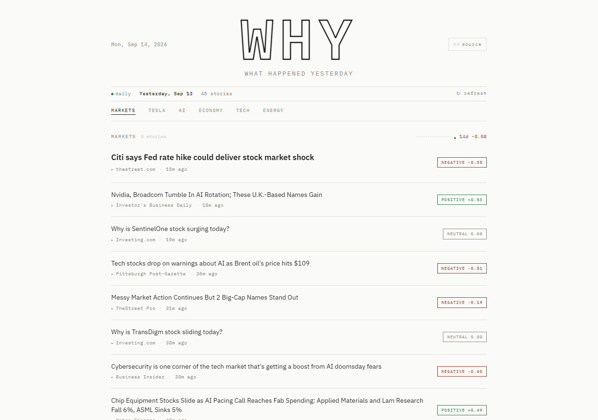
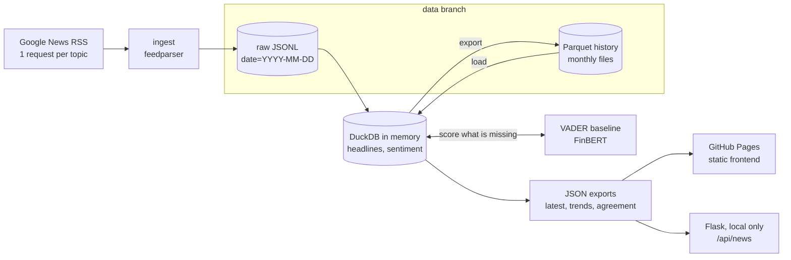

# WHY: What Happened Yesterday

[](https://github.com/Onodera-Gustavo/W-H-Y/actions/workflows/ci.yml)
[](https://github.com/Onodera-Gustavo/W-H-Y/actions/workflows/pipeline.yml)


A daily data pipeline that collects market headlines from Google News RSS, keeps a deduplicated history in DuckDB and Parquet, scores sentiment with VADER and FinBERT, measures how much the two models agree, and publishes the result as a static, newspaper style site.

**Live demo:** [onodera-gustavo.github.io/W-H-Y](https://onodera-gustavo.github.io/W-H-Y/) (live after GitHub Pages is enabled)



## The problem

Markets move on news, and a single morning already brings hundreds of headlines across topics. WHY answers two small questions every day: what were yesterday's headlines for each topic, and was their tone positive, neutral or negative? It also shows how that tone moves over two weeks.

The interesting part is the plumbing behind the page. Collection has to be polite and repeatable, re-running a day must not duplicate anything, the history has to live somewhere cheap and inspectable, and a sentiment model's output should be checked instead of simply trusted.

## Architecture



### Daily run (GitHub Actions, 09:00 UTC)

1. Check out `main`, plus the `data` branch into `data/` (created on the first run).
2. `python -m why run --models vader,finbert`: one RSS request per topic, raw JSONL landing, load into DuckDB, score only the headlines that have no score yet, export Parquet and JSON.
3. `python -m why compare`: VADER x FinBERT agreement over the whole history.
4. Commit the raw JSONL and Parquet files to the `data` branch as `github-actions[bot]`.
5. Put `frontend/` next to `site/data/` and deploy it to GitHub Pages.

### Data layout

| Path | Content |
| --- | --- |
| `data/raw/date=YYYY-MM-DD/<topic>.jsonl` | feed as collected: topic, title, source, link, published_at, collected_at, run_date |
| `data/history/headlines/YYYY-MM.parquet` | one row per story per topic, with dedup key and first/last seen |
| `data/history/sentiment/YYYY-MM.parquet` | one row per story per model: label and score from -1 to +1 |
| `site/data/latest.json` | the daily edition read by the frontend |
| `site/data/trends.json` | daily mean sentiment and headline counts per topic, last 14 days |
| `site/data/model_agreement.json` | percent agreement, Cohen's kappa, confusion matrix, score correlation |

### Code layout

```
why/
  config.py        topics, limits, paths
  ingest.py        Google News RSS to raw records (requests + feedparser)
  raw.py           JSONL landing zone, idempotent per day
  dedup.py         link normalization and dedup key
  warehouse.py     DuckDB tables, upsert, Parquet load and export
  sentiment.py     common interface, VADER and FinBERT adapters
  metrics.py       percent agreement, Cohen's kappa, confusion matrix
  export.py        latest.json, trends.json, model_agreement.json
  cli.py           py -m why run | compare
backend/app.py     local Flask server: frontend + /api
frontend/          static page (IBM Plex, no build step)
tests/             offline pytest suite with an RSS fixture
.github/workflows/ ci.yml, pipeline.yml
```

## Decisions and trade-offs

**DuckDB and Parquet on a `data` branch instead of a database server.** About 50 headlines a day do not justify a running server or a paid bucket. DuckDB gives real SQL in process (window functions, `QUALIFY`, `COPY ... TO` Parquet), and Parquet is columnar, compressed and readable by pandas, Polars or Spark. Keeping the files on an orphan `data` branch turns every run into a commit that can be diffed, audited or rolled back, at no cost. The trade-offs: a single writer (the workflow uses a concurrency group), a branch that grows over time, and a design that would not hold millions of rows a day. To limit churn, the history is split into monthly files and written sorted, so a daily run normally rewrites only the current month and an unchanged month produces no git diff.

**VADER as a baseline, FinBERT as the finance model, and their agreement measured.** VADER is a lexicon model: instant, deterministic and download free, but built for social media text. FinBERT ([ProsusAI/finbert](https://huggingface.co/ProsusAI/finbert)) is BERT fine-tuned on financial news sentences and much heavier (PyTorch plus a ~440 MB model), so it runs only in GitHub Actions, on CPU, with the model cached. Instead of assuming either one is right, `why compare` reports percent agreement, Cohen's kappa (agreement corrected for chance), the confusion matrix and the correlation between scores for every headline both models scored. The site shows FinBERT when available and VADER otherwise, and hovering a badge shows both.

**Idempotency and dedup.**
- Raw files are the source of truth. A day's partition is merged by dedup key and written sorted and atomically, so re-running a day produces identical files. A past date can be replayed with `--date` without network, for example to rebuild the history.
- The dedup key is a hash of the normalized link (tracking parameters such as `oc` and `utm_*`, fragment, `www`, scheme and trailing slash ignored), with title + source as the fallback when there is no usable link. A story seen on two mornings is stored once, with `first_seen_at` and `last_seen_at`.
- Scores are keyed by story and model, and a run only scores what is missing. Re-runs cost nothing, a story filed under two topics is scored once, and a newly added model backfills the whole history on its first run.

**A static site instead of an always-on API.** The frontend only reads JSON files, so GitHub Pages hosts it for free. Flask exists for local development and serves the same data under `/api`.

**Politeness.** One request per topic per run, once a day, a User-Agent that identifies the project and no retry loop. Google's `when:1d` search operator keeps the feed inside the last 24 hours (in a spot check, 100 of 100 entries were recent with it, 72 of 100 without it).

## Run locally

Requires Python 3.12 or newer. On Windows, `py` works in place of `python`.

```bash
python -m venv .venv
source .venv/bin/activate          # Windows: .venv\Scripts\activate
pip install -r requirements-dev.txt

python -m why run                  # fetch today's headlines and score them with VADER
python -m why run                  # again: 0 new rows, nothing duplicated
python backend/app.py              # http://localhost:5000
```

FinBERT is optional locally (the model download is about 440 MB on first use):

```bash
pip install torch --index-url https://download.pytorch.org/whl/cpu
pip install -r requirements-finbert.txt
python -m why run --models vader,finbert   # scores today and backfills FinBERT for the history
python -m why compare                      # writes site/data/model_agreement.json
```

| Command or variable | What it does |
| --- | --- |
| `python -m why run --date 2026-09-14` | replays a past day from its raw partition, without network |
| `WHY_DATA_DIR`, `WHY_SITE_DATA_DIR` | move raw/history and the JSON exports elsewhere |
| `WHY_DEBUG=1`, `PORT` | Flask debug mode and port |

## Tests

```bash
ruff check .
pytest
```

The suite runs offline (a fixture fails any real HTTP call) in a few seconds and covers:

- RSS parsing from a local XML fixture, dates without a timezone or invalid, titles that contain " - ", duplicate links
- raw partition idempotency and dedup across two runs, including a Parquet round trip
- VADER thresholds and the FinBERT adapter with a fake `transformers` pipeline (no download)
- the export formats the frontend reads, trend aggregation, Cohen's kappa on a textbook example
- the CLI end to end and the Flask API through its test client

CI runs lint and tests on every push to `main` and on pull requests.

## Limitations

- **Headlines only.** Sentiment is scored on titles, not article bodies. A headline can be partial, ironic or clickbait.
- **Google News RSS terms.** Using the feed is subject to Google's Terms of Service. This is a non-commercial study project: it stores titles and links only, links back to the publishers and makes six requests a day. Review the terms before reusing the data or running it at a larger scale. WHY is not affiliated with Google.
- **VADER is not trained for finance.** Its lexicon misses market phrasing: it scores "Earnings beat estimates" as neutral and "Shares fall short of expectations" as positive. That gap is the reason FinBERT and the agreement report exist.
- **Agreement is not accuracy.** There are no human labels, so the report says how often the models agree, not which one is right.
- **Dedup is by link.** The same story published by several outlets counts once per outlet.
- **Daily granularity.** Trends group headlines by the UTC date they were first seen, not by publication time.

## Roadmap

- Hand-label a sample of headlines to measure accuracy, not only agreement
- Near-duplicate detection (same story, different outlets) based on title similarity
- Data quality checks as a pipeline step: row counts per topic, freshness, schema
- More sources behind the same ingest interface (publisher RSS feeds, Reddit)
- Ticker level pages and a longer trend window

## Credits

- VADER: C. J. Hutto and E. Gilbert, *VADER: A Parsimonious Rule-based Model for Sentiment Analysis of Social Media Text* (ICWSM 2014).
- FinBERT: D. Araci, *FinBERT: Financial Sentiment Analysis with Pre-trained Language Models* (2019), model published by Prosus AI.
